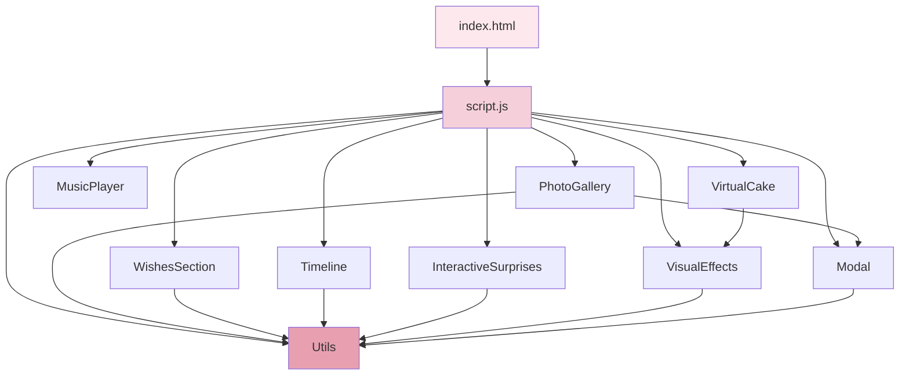
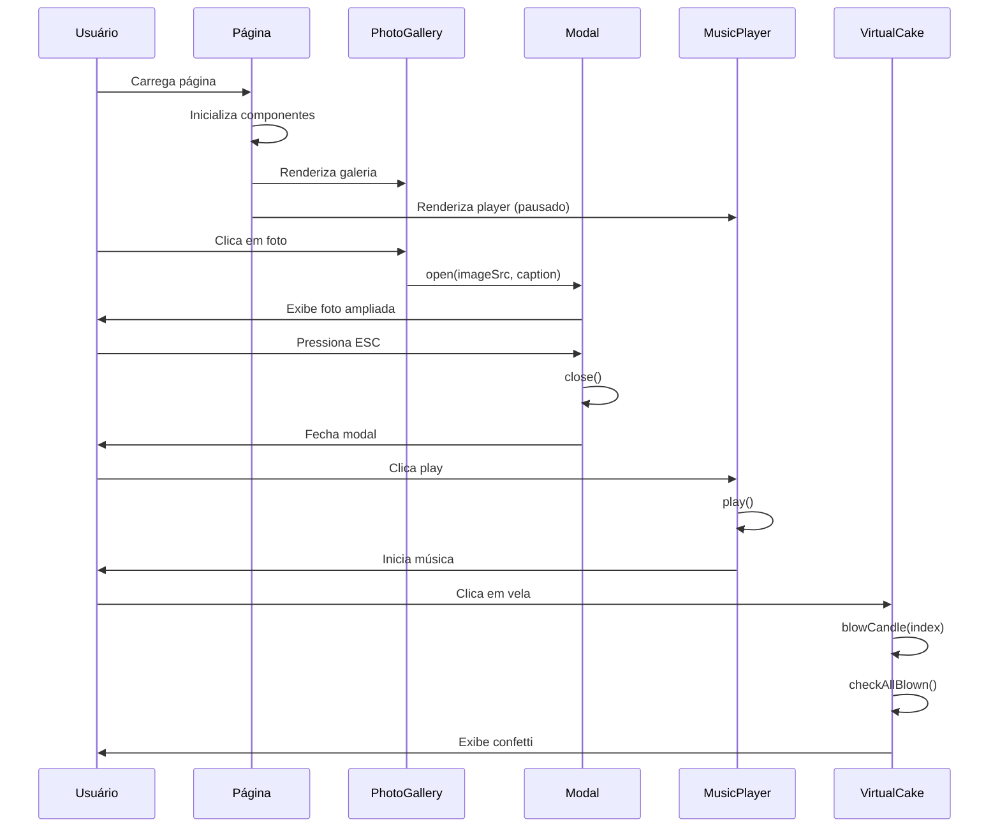
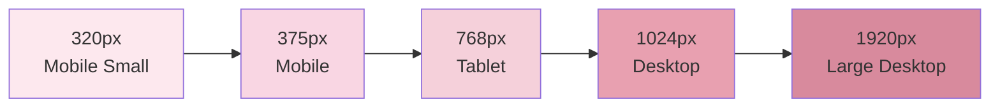

# Design Document: Melhorias Interativas para Site de Aniversário

## Overview

Este documento especifica o design técnico para adicionar funcionalidades interativas e festivas ao site de aniversário da Sofia. O objetivo é criar uma experiência de celebração memorável mantendo o estilo delicado existente (cores rosa/cream, fontes Playfair Display + Lato).

### Objetivos do Design

1. **Modularidade**: Componentes independentes e reutilizáveis
2. **Performance**: Carregamento rápido e animações fluidas (60fps)
3. **Responsividade**: Experiência consistente em dispositivos de 320px a 1920px
4. **Acessibilidade**: Navegação por teclado, contraste adequado, suporte a prefers-reduced-motion
5. **Manutenibilidade**: Código limpo, bem documentado e fácil de estender

### Escopo das Funcionalidades

- Galeria de fotos em formato polaroid com modal de visualização
- Player de música de fundo com controles minimalistas
- Seção de desejos de aniversário em cards animados
- Linha do tempo de momentos especiais
- Surpresas interativas clicáveis
- Bolo virtual interativo com efeito de soprar velas
- Efeitos visuais festivos (parallax, sparkles, balões, confetti)
- Otimizações de performance e acessibilidade

## Architecture

### Arquitetura Geral

O site mantém a arquitetura vanilla (HTML/CSS/JavaScript) sem frameworks, seguindo o padrão existente:

```
index.html          # Estrutura semântica com sections
├── style.css       # Estilos com CSS variables e animações
└── script.js       # Lógica JavaScript modular
```

### Princípios Arquiteturais

1. **Progressive Enhancement**: Funcionalidades básicas funcionam sem JavaScript
2. **Mobile-First**: Design responsivo começando por mobile
3. **Separation of Concerns**: HTML (estrutura), CSS (apresentação), JS (comportamento)
4. **Performance Budget**: 
   - Carregamento inicial < 3s em 3G
   - Imagens otimizadas (WebP/JPEG)
   - Música < 5MB
   - Lazy loading para imagens

### Estrutura de Módulos JavaScript

```javascript
// script.js será organizado em módulos funcionais:

// 1. Countdown (existente - manter)
// 2. Particles (existente - manter)
// 3. PhotoGallery (novo)
// 4. MusicPlayer (novo)
// 5. WishesSection (novo)
// 6. Timeline (novo)
// 7. InteractiveSurprises (novo)
// 8. VirtualCake (novo)
// 9. VisualEffects (novo)
// 10. Modal (novo)
// 11. Utils (novo - helpers compartilhados)
```

## Components and Interfaces

### 1. PhotoGallery Component

**Responsabilidade**: Gerenciar galeria de fotos em formato polaroid com animações e interatividade.

**HTML Structure**:
```html
<section class="photo-gallery" id="photoGallery">
  <div class="container">
    <h2 class="section-title">Nossos Momentos 📸</h2>
    <div class="polaroid-grid">
      <div class="polaroid" data-index="0">
        
        <p class="polaroid-caption">Legenda opcional</p>
      </div>
      <!-- Repetir para 6-12 fotos -->
    </div>
  </div>
</section>
```

**CSS Classes**:
- `.photo-gallery`: Container da seção
- `.polaroid-grid`: Grid responsivo (3 colunas desktop, 2 tablet, 1 mobile)
- `.polaroid`: Card individual com borda branca, sombra e rotação aleatória
- `.polaroid-caption`: Texto abaixo da foto

**JavaScript Interface**:
```javascript
const PhotoGallery = {
  photos: [], // Array de objetos {src, alt, caption}
  
  init() {
    // Inicializa galeria
    // Aplica rotações aleatórias (-5° a +5°)
    // Configura lazy loading
    // Adiciona event listeners para hover e click
  },
  
  applyRandomRotations() {
    // Aplica rotação aleatória a cada polaroid
  },
  
  animateOnScroll() {
    // Reveal animation escalonada usando Intersection Observer
  },
  
  openModal(index) {
    // Abre modal com foto ampliada
  }
};
```

**Animações CSS**:
- Hover: `transform: rotate(0deg) translateY(-10px) scale(1.05)` + sombra aumentada
- Reveal: `@keyframes fadeInUp` com delay escalonado (0.1s entre cada)

---

### 2. MusicPlayer Component

**Responsabilidade**: Reproduzir música de fundo com controles minimalistas.

**HTML Structure**:
```html
<div class="music-player" id="musicPlayer">
  <audio id="bgMusic" preload="metadata">
    <source src="music/birthday-song.mp3" type="audio/mpeg">
    <source src="music/birthday-song.ogg" type="audio/ogg">
  </audio>
  <button class="music-toggle" aria-label="Play/Pause música">
    <span class="icon-play">▶️</span>
    <span class="icon-pause" style="display:none;">⏸️</span>
  </button>
  <span class="music-icon">🎂</span>
</div>
```

**CSS Classes**:
- `.music-player`: Posição fixa (bottom-right ou top-right)
- `.music-toggle`: Botão circular com fundo rosa claro
- `.music-icon`: Emoji decorativo

**JavaScript Interface**:
```javascript
const MusicPlayer = {
  audio: null,
  isPlaying: false,
  
  init() {
    // Inicializa player
    // Configura event listeners
  },
  
  toggle() {
    // Alterna entre play/pause
    // Atualiza ícone
  },
  
  play() {
    // Inicia reprodução
  },
  
  pause() {
    // Pausa reprodução
  }
};
```

---

### 3. WishesSection Component

**Responsabilidade**: Exibir lista de desejos em cards animados.

**HTML Structure**:
```html
<section class="wishes-section" id="wishes">
  <div class="container">
    <h2 class="section-title">Meus Desejos Para Você 🎁</h2>
    <div class="wishes-grid">
      <div class="wish-card">
        <span class="wish-number">1</span>
        <span class="wish-emoji">🎂</span>
        <p class="wish-text">Que você tenha muita saúde e alegria</p>
      </div>
      <!-- Repetir para 8-15 desejos -->
    </div>
  </div>
</section>
```

**CSS Classes**:
- `.wishes-section`: Container da seção
- `.wishes-grid`: Grid responsivo (3 colunas desktop, 2 tablet, 1 mobile)
- `.wish-card`: Card com fundo branco, borda rosa, sombra suave
- `.wish-number`: Número sequencial estilizado
- `.wish-emoji`: Emoji decorativo aleatório

**JavaScript Interface**:
```javascript
const WishesSection = {
  wishes: [], // Array de strings com desejos
  emojis: ['🎂', '🎉', '🎈', '🌸', '✨', '🎁'],
  
  init() {
    // Renderiza cards
    // Atribui emojis aleatórios
    // Configura animação de entrada
  },
  
  animateOnScroll() {
    // Fade-in progressivo usando Intersection Observer
  },
  
  getRandomEmoji() {
    // Retorna emoji aleatório do array
  }
};
```

**Animações CSS**:
- Hover: `transform: translateY(-5px)` + sombra aumentada
- Entrada: `@keyframes fadeIn` com delay progressivo

---

### 4. Timeline Component

**Responsabilidade**: Exibir linha do tempo vertical de momentos especiais.

**HTML Structure**:
```html
<section class="timeline-section" id="timeline">
  <div class="container">
    <h2 class="section-title">Momentos Especiais 🌟</h2>
    <div class="timeline">
      <div class="timeline-item left">
        <div class="timeline-marker">🎂</div>
        <div class="timeline-content">
          <span class="timeline-date">21/05/2020</span>
          <h3 class="timeline-title">Título do Momento</h3>
          <p class="timeline-description">Descrição curta</p>
        </div>
      </div>
      <div class="timeline-item right">
        <!-- Alterna esquerda/direita -->
      </div>
      <!-- Repetir para 4-8 marcos -->
    </div>
  </div>
</section>
```

**CSS Classes**:
- `.timeline`: Container com linha vertical central
- `.timeline-item`: Item individual (`.left` ou `.right`)
- `.timeline-marker`: Círculo com emoji na linha
- `.timeline-content`: Card com conteúdo

**JavaScript Interface**:
```javascript
const Timeline = {
  moments: [], // Array de objetos {date, title, description, emoji}
  
  init() {
    // Renderiza timeline
    // Alterna posicionamento (left/right)
  },
  
  animateOnScroll() {
    // Reveal animation sequencial usando Intersection Observer
  }
};
```

---

### 5. InteractiveSurprises Component

**Responsabilidade**: Gerenciar surpresas clicáveis que revelam conteúdo especial.

**HTML Structure**:
```html
<section class="surprises-section" id="surprises">
  <div class="container">
    <h2 class="section-title">Surpresas Para Você 🎁</h2>
    <p class="surprises-hint">Clique nos presentes para descobrir!</p>
    <div class="surprises-grid">
      <div class="surprise-box" data-surprise-id="0">
        <div class="surprise-icon">🎁</div>
        <div class="surprise-content" style="display:none;">
          <p>Conteúdo da surpresa revelado!</p>
        </div>
      </div>
      <!-- Repetir para 3-5 surpresas -->
    </div>
  </div>
</section>
```

**CSS Classes**:
- `.surprises-grid`: Grid responsivo
- `.surprise-box`: Container clicável
- `.surprise-icon`: Ícone inicial (presente, balão, caixa)
- `.surprise-content`: Conteúdo revelado

**JavaScript Interface**:
```javascript
const InteractiveSurprises = {
  surprises: [], // Array de objetos {icon, content}
  revealedState: {}, // Objeto para rastrear estado {id: boolean}
  
  init() {
    // Configura event listeners
    // Restaura estado da sessão (sessionStorage)
  },
  
  toggleSurprise(id) {
    // Alterna entre revelado/oculto
    // Salva estado em sessionStorage
    // Aplica animação
  },
  
  saveState() {
    // Persiste estado em sessionStorage
  },
  
  loadState() {
    // Carrega estado de sessionStorage
  }
};
```

**Animações CSS**:
- Reveal: `@keyframes scaleIn` + confetti opcional
- Hover: Cursor pointer + leve escala

---

### 6. VirtualCake Component

**Responsabilidade**: Bolo virtual interativo com efeito de soprar velas.

**HTML Structure**:
```html
<section class="cake-section" id="virtualCake">
  <div class="container">
    <h2 class="section-title">Sopre as Velas! 🎂</h2>
    <p class="cake-instruction">Clique nas velas para apagá-las</p>
    <div class="cake-container">
      <div class="cake">
        <div class="candle" data-candle="0">
          <div class="flame"></div>
        </div>
        <div class="candle" data-candle="1">
          <div class="flame"></div>
        </div>
        <div class="candle" data-candle="2">
          <div class="flame"></div>
        </div>
      </div>
    </div>
    <p class="cake-message" style="display:none;">
      🎉 Parabéns! Que todos os seus desejos se realizem! 🎉
    </p>
  </div>
</section>
```

**CSS Classes**:
- `.cake-container`: Container centralizado
- `.cake`: Ilustração do bolo (CSS art ou SVG)
- `.candle`: Vela individual
- `.flame`: Chama animada (CSS animation)
- `.candle.blown`: Classe para vela apagada

**JavaScript Interface**:
```javascript
const VirtualCake = {
  totalCandles: 3,
  blownCandles: 0,
  
  init() {
    // Configura event listeners nas velas
  },
  
  blowCandle(candleIndex) {
    // Apaga vela específica
    // Incrementa contador
    // Verifica se todas foram apagadas
  },
  
  checkAllBlown() {
    // Se todas apagadas: mostra mensagem + confetti
  },
  
  reset() {
    // Reacende todas as velas
  }
};
```

**Animações CSS**:
- Chama: `@keyframes flicker` (tremulação)
- Apagar: `@keyframes fadeOut` na chama
- Confetti: Reutiliza função existente `launchConfetti()`

---

### 7. VisualEffects Component

**Responsabilidade**: Gerenciar efeitos visuais festivos (parallax, sparkles, balões).

**JavaScript Interface**:
```javascript
const VisualEffects = {
  init() {
    // Inicializa todos os efeitos
    this.initParallax();
    this.initSparkles();
    this.initFloatingBalloons();
    this.initScrollAnimations();
  },
  
  initParallax() {
    // Efeito parallax em backgrounds de seções
    // Usa scroll event com throttle
  },
  
  initSparkles() {
    // Adiciona sparkles em hover de elementos decorativos
  },
  
  initFloatingBalloons() {
    // Cria balões flutuantes animados
  },
  
  initScrollAnimations() {
    // Fade-in + slide-up usando Intersection Observer
  },
  
  createConfetti(x, y) {
    // Cria explosão de confetti em posição específica
  }
};
```

---

### 8. Modal Component

**Responsabilidade**: Modal genérico para visualização de fotos ampliadas.

**HTML Structure**:
```html
<div class="modal" id="photoModal" style="display:none;">
  <div class="modal-overlay"></div>
  <div class="modal-content">
    <button class="modal-close" aria-label="Fechar">&times;</button>
    
    <p class="modal-caption"></p>
  </div>
</div>
```

**CSS Classes**:
- `.modal`: Container full-screen
- `.modal-overlay`: Fundo escuro semi-transparente
- `.modal-content`: Conteúdo centralizado
- `.modal-close`: Botão de fechar

**JavaScript Interface**:
```javascript
const Modal = {
  modalEl: null,
  imageEl: null,
  captionEl: null,
  
  init() {
    // Configura event listeners (overlay, close button, ESC key)
  },
  
  open(imageSrc, caption) {
    // Abre modal com imagem e legenda
    // Aplica animação de entrada
    // Bloqueia scroll do body
  },
  
  close() {
    // Fecha modal
    // Aplica animação de saída
    // Restaura scroll do body
  }
};
```

**Animações CSS**:
- Entrada: `@keyframes fadeIn` no overlay + `@keyframes scaleIn` na imagem
- Saída: Reverso das animações de entrada

---

### 9. Utils Module

**Responsabilidade**: Funções utilitárias compartilhadas.

**JavaScript Interface**:
```javascript
const Utils = {
  // Throttle para eventos de scroll
  throttle(func, delay) {
    let lastCall = 0;
    return function(...args) {
      const now = Date.now();
      if (now - lastCall >= delay) {
        lastCall = now;
        func(...args);
      }
    };
  },
  
  // Debounce para eventos de resize
  debounce(func, delay) {
    let timeout;
    return function(...args) {
      clearTimeout(timeout);
      timeout = setTimeout(() => func(...args), delay);
    };
  },
  
  // Intersection Observer helper
  observeElements(selector, callback, options = {}) {
    const observer = new IntersectionObserver((entries) => {
      entries.forEach(entry => {
        if (entry.isIntersecting) {
          callback(entry.target);
          observer.unobserve(entry.target);
        }
      });
    }, options);
    
    document.querySelectorAll(selector).forEach(el => observer.observe(el));
  },
  
  // Verifica preferência de movimento reduzido
  prefersReducedMotion() {
    return window.matchMedia('(prefers-reduced-motion: reduce)').matches;
  },
  
  // Gera número aleatório em range
  randomInRange(min, max) {
    return Math.random() * (max - min) + min;
  },
  
  // Shuffle array
  shuffleArray(array) {
    const shuffled = [...array];
    for (let i = shuffled.length - 1; i > 0; i--) {
      const j = Math.floor(Math.random() * (i + 1));
      [shuffled[i], shuffled[j]] = [shuffled[j], shuffled[i]];
    }
    return shuffled;
  }
};
```

## Data Models

### Photo Object
```javascript
{
  src: String,        // Caminho da imagem (ex: "gallery/photo1.jpg")
  alt: String,        // Texto alternativo para acessibilidade
  caption: String     // Legenda opcional (pode ser vazio)
}
```

### Wish Object
```javascript
{
  text: String,       // Texto do desejo
  emoji: String       // Emoji decorativo (atribuído aleatoriamente)
}
```

### Timeline Moment Object
```javascript
{
  date: String,       // Data formatada (ex: "21/05/2020")
  title: String,      // Título do momento
  description: String, // Descrição curta
  emoji: String       // Emoji representativo (🎂, 🎓, 🌟, etc.)
}
```

### Surprise Object
```javascript
{
  id: Number,         // Identificador único
  icon: String,       // Emoji do ícone (🎁, 🎈, 📦, etc.)
  content: String     // HTML do conteúdo revelado
}
```

### Player State
```javascript
{
  isPlaying: Boolean, // Estado de reprodução
  currentTime: Number, // Tempo atual (opcional para futuras melhorias)
  duration: Number    // Duração total (opcional)
}
```

### Modal State
```javascript
{
  isOpen: Boolean,    // Modal aberto/fechado
  currentImage: String, // URL da imagem atual
  currentCaption: String // Legenda atual
}
```


## Correctness Properties

*A property is a characteristic or behavior that should hold true across all valid executions of a system—essentially, a formal statement about what the system should do. Properties serve as the bridge between human-readable specifications and machine-verifiable correctness guarantees.*

### Property-Based Testing Applicability Assessment

Este projeto envolve principalmente:
- **UI rendering e interações**: Componentes visuais (galeria, cards, timeline)
- **Animações e efeitos visuais**: CSS animations, parallax, confetti
- **Manipulação de DOM**: Criação dinâmica de elementos
- **Estado de UI**: Modal aberto/fechado, música tocando/pausada, surpresas reveladas

**Conclusão**: Property-based testing (PBT) **NÃO é apropriado** para este projeto porque:

1. **UI Rendering**: A maioria dos requisitos envolve renderização visual e layout, que são melhor testados com snapshot tests ou testes visuais
2. **Animações**: Efeitos visuais não têm propriedades universais testáveis por PBT
3. **Interações de usuário**: Comportamentos como click, hover são melhor testados com testes de exemplo específicos
4. **Estado de sessão**: Persistência em sessionStorage é melhor testada com testes de integração

**Estratégia de Teste Recomendada**:
- **Testes manuais**: Verificação visual de layouts, animações e responsividade
- **Testes de exemplo**: Casos específicos de interação (click em vela, abrir modal, toggle música)
- **Testes de acessibilidade**: Navegação por teclado, contraste, ARIA labels
- **Testes de performance**: Lighthouse scores, tempo de carregamento

Portanto, **não incluiremos a seção de Correctness Properties** neste design, seguindo as diretrizes do workflow.

## Error Handling

### 1. Carregamento de Recursos

**Imagens não encontradas**:
```javascript
// Fallback para imagens quebradas
img.onerror = function() {
  this.src = 'data:image/svg+xml,...'; // SVG placeholder
  this.alt = 'Imagem não disponível';
};
```

**Música não disponível**:
```javascript
audio.onerror = function() {
  // Oculta player se música não carregar
  document.getElementById('musicPlayer').style.display = 'none';
  console.warn('Música de fundo não disponível');
};
```

### 2. Compatibilidade de Browser

**Intersection Observer não suportado**:
```javascript
if (!('IntersectionObserver' in window)) {
  // Fallback: mostra todos os elementos imediatamente
  document.querySelectorAll('.animate-on-scroll').forEach(el => {
    el.classList.add('visible');
  });
}
```

**sessionStorage não disponível**:
```javascript
function saveState(key, value) {
  try {
    sessionStorage.setItem(key, JSON.stringify(value));
  } catch (e) {
    console.warn('sessionStorage não disponível:', e);
    // Estado não será persistido, mas funcionalidade continua
  }
}
```

### 3. Validação de Dados

**Array de fotos vazio**:
```javascript
if (!photos || photos.length === 0) {
  // Exibe mensagem amigável
  document.querySelector('.polaroid-grid').innerHTML = 
    '<p class="empty-message">Adicione fotos para criar a galeria 📸</p>';
  return;
}
```

**Dados de timeline inválidos**:
```javascript
moments.forEach((moment, index) => {
  if (!moment.title || !moment.date) {
    console.warn(`Momento ${index} inválido, pulando...`);
    return; // Pula item inválido
  }
  // Renderiza momento válido
});
```

### 4. Eventos de Usuário

**Clicks múltiplos rápidos**:
```javascript
let isAnimating = false;

function handleClick() {
  if (isAnimating) return; // Previne clicks durante animação
  
  isAnimating = true;
  // Executa ação
  setTimeout(() => { isAnimating = false; }, 500);
}
```

**Scroll excessivo**:
```javascript
// Usa throttle para limitar chamadas
const handleScroll = Utils.throttle(() => {
  // Lógica de parallax
}, 16); // ~60fps

window.addEventListener('scroll', handleScroll);
```

### 5. Performance

**Muitas partículas/confetti**:
```javascript
const MAX_PARTICLES = 100;
let particleCount = 0;

function createParticle() {
  if (particleCount >= MAX_PARTICLES) {
    console.warn('Limite de partículas atingido');
    return;
  }
  particleCount++;
  // Cria partícula
  // Decrementa contador quando remover
}
```

**Memory leaks em event listeners**:
```javascript
// Sempre remover listeners quando não necessários
const controller = new AbortController();

element.addEventListener('click', handler, { signal: controller.signal });

// Cleanup
function cleanup() {
  controller.abort(); // Remove todos os listeners
}
```

### 6. Acessibilidade

**Animações com prefers-reduced-motion**:
```javascript
if (Utils.prefersReducedMotion()) {
  // Desabilita animações complexas
  document.body.classList.add('reduced-motion');
}
```

```css
.reduced-motion * {
  animation-duration: 0.01ms !important;
  animation-iteration-count: 1 !important;
  transition-duration: 0.01ms !important;
}
```

**Focus trap em modal**:
```javascript
Modal.open = function(src, caption) {
  // ... código de abertura
  
  // Salva elemento com foco anterior
  this.previousFocus = document.activeElement;
  
  // Move foco para modal
  this.modalEl.querySelector('.modal-close').focus();
};

Modal.close = function() {
  // ... código de fechamento
  
  // Restaura foco anterior
  if (this.previousFocus) {
    this.previousFocus.focus();
  }
};
```

## Testing Strategy

### 1. Testes Manuais

**Responsividade**:
- [ ] Testar em Chrome DevTools com viewports: 320px, 375px, 768px, 1024px, 1920px
- [ ] Verificar quebras de layout em cada breakpoint
- [ ] Testar orientação portrait e landscape em tablets

**Animações**:
- [ ] Verificar fluidez (60fps) em todas as animações
- [ ] Testar com prefers-reduced-motion ativado
- [ ] Verificar timing e delays das animações escalonadas

**Interatividade**:
- [ ] Clicar em todos os elementos interativos (polaroids, surpresas, velas, modal)
- [ ] Testar hover effects em desktop
- [ ] Verificar feedback visual em mobile (touch)

**Cross-browser**:
- [ ] Chrome/Edge (Chromium)
- [ ] Firefox
- [ ] Safari (desktop e iOS)
- [ ] Samsung Internet (Android)

### 2. Testes de Acessibilidade

**Navegação por teclado**:
- [ ] Tab através de todos os elementos interativos
- [ ] Enter/Space para ativar botões
- [ ] ESC para fechar modal
- [ ] Verificar ordem lógica de foco

**Screen readers**:
- [ ] Testar com NVDA (Windows) ou VoiceOver (Mac/iOS)
- [ ] Verificar ARIA labels em botões
- [ ] Confirmar alt text em imagens
- [ ] Testar anúncios de mudanças de estado

**Contraste**:
- [ ] Usar ferramenta de contraste (ex: WebAIM Contrast Checker)
- [ ] Verificar texto sobre fundos coloridos
- [ ] Confirmar ratio mínimo 4.5:1 para texto normal

### 3. Testes de Performance

**Lighthouse**:
- [ ] Performance score > 90
- [ ] Accessibility score > 95
- [ ] Best Practices score > 90
- [ ] First Contentful Paint < 1.5s
- [ ] Largest Contentful Paint < 2.5s

**Network**:
- [ ] Testar com throttling 3G
- [ ] Verificar lazy loading de imagens
- [ ] Confirmar tamanho total < 3MB (sem música)
- [ ] Verificar compressão de imagens

**Memory**:
- [ ] Usar Chrome DevTools Memory profiler
- [ ] Verificar ausência de memory leaks após interações
- [ ] Confirmar limpeza de event listeners

### 4. Testes de Integração

**Fluxo completo do usuário**:
1. Carregar página
2. Visualizar countdown e partículas
3. Scroll através de todas as seções
4. Clicar em foto para abrir modal
5. Fechar modal com ESC
6. Iniciar música
7. Pausar música
8. Revelar todas as surpresas
9. Soprar todas as velas do bolo
10. Verificar confetti

**Persistência de estado**:
- [ ] Revelar surpresas, recarregar página, verificar estado mantido
- [ ] Limpar sessionStorage, verificar reset de estado

### 5. Testes de Conteúdo

**Validação de dados**:
- [ ] Galeria com 6 fotos
- [ ] Galeria com 12 fotos
- [ ] Galeria vazia (deve mostrar mensagem)
- [ ] Fotos sem legenda
- [ ] Timeline com 4 momentos
- [ ] Timeline com 8 momentos
- [ ] Desejos com 8 items
- [ ] Desejos com 15 items

### 6. Checklist de Qualidade

**Antes do deploy**:
- [ ] Todas as imagens otimizadas (WebP com fallback JPEG)
- [ ] Música comprimida < 5MB
- [ ] CSS minificado
- [ ] JavaScript minificado
- [ ] Sem console.log em produção
- [ ] Favicon adicionado
- [ ] Meta tags Open Graph configuradas
- [ ] Testado em pelo menos 3 dispositivos reais
- [ ] Validação HTML (W3C Validator)
- [ ] Validação CSS (W3C CSS Validator)

### 7. Ferramentas Recomendadas

**Desenvolvimento**:
- Chrome DevTools (Lighthouse, Performance, Network)
- Firefox Developer Tools
- VS Code com extensões: Live Server, Prettier, ESLint

**Testes**:
- WebAIM Contrast Checker
- WAVE (Web Accessibility Evaluation Tool)
- axe DevTools
- Responsively App (teste multi-device)

**Otimização**:
- Squoosh (compressão de imagens)
- TinyPNG
- FFmpeg (compressão de áudio)
- CSS Minifier
- JavaScript Minifier

## Implementation Plan

### Phase 1: Estrutura Base (Prioridade Alta)

**1.1 Atualizar HTML**
- Adicionar sections para novos componentes
- Incluir estrutura de modal
- Adicionar player de música
- Adicionar meta tags e favicon

**1.2 Expandir CSS Variables**
- Adicionar novas cores se necessário
- Definir breakpoints responsivos
- Criar classes utilitárias (`.container`, `.section-title`)

**1.3 Criar Utils Module**
- Implementar throttle, debounce
- Implementar observeElements
- Implementar helpers de acessibilidade

### Phase 2: Componentes Visuais (Prioridade Alta)

**2.1 PhotoGallery Component**
- Criar HTML da galeria
- Estilizar polaroids com CSS
- Implementar rotações aleatórias
- Adicionar hover effects
- Implementar lazy loading
- Configurar Intersection Observer para animações

**2.2 WishesSection Component**
- Criar HTML dos cards
- Estilizar grid responsivo
- Implementar atribuição aleatória de emojis
- Adicionar animações de entrada

**2.3 Timeline Component**
- Criar HTML da timeline
- Estilizar linha vertical e markers
- Implementar alternância left/right
- Adicionar animações sequenciais

### Phase 3: Componentes Interativos (Prioridade Alta)

**3.1 Modal Component**
- Criar HTML do modal
- Estilizar overlay e conteúdo
- Implementar open/close
- Adicionar event listeners (click, ESC)
- Implementar focus trap
- Adicionar animações

**3.2 MusicPlayer Component**
- Criar HTML do player
- Estilizar controles
- Implementar toggle play/pause
- Adicionar feedback visual
- Tratar erros de carregamento

**3.3 InteractiveSurprises Component**
- Criar HTML das surpresas
- Estilizar estados (oculto/revelado)
- Implementar toggle
- Adicionar persistência (sessionStorage)
- Adicionar animações de revelação

**3.4 VirtualCake Component**
- Criar HTML do bolo e velas
- Estilizar com CSS (ou usar SVG)
- Implementar animação de chama
- Implementar lógica de soprar velas
- Adicionar confetti ao completar
- Implementar reset

### Phase 4: Efeitos Visuais (Prioridade Média)

**4.1 Parallax Effect**
- Implementar scroll listener com throttle
- Aplicar transformações em backgrounds
- Testar performance

**4.2 Sparkles Effect**
- Criar elementos de sparkle
- Adicionar em hover de elementos decorativos
- Implementar animação CSS

**4.3 Floating Balloons**
- Criar elementos de balão
- Estilizar com CSS
- Implementar animação de flutuação
- Adicionar em seção específica

**4.4 Enhanced Confetti**
- Melhorar função existente launchConfetti()
- Adicionar variações (cores, formas, velocidades)
- Implementar confetti em eventos específicos (velas apagadas, surpresas)

### Phase 5: Otimizações (Prioridade Média)

**5.1 Performance**
- Implementar lazy loading de imagens
- Otimizar todas as imagens (WebP + JPEG fallback)
- Comprimir arquivo de música
- Minificar CSS e JavaScript
- Adicionar preload para recursos críticos

**5.2 Acessibilidade**
- Adicionar ARIA labels em todos os botões
- Implementar navegação por teclado
- Adicionar suporte a prefers-reduced-motion
- Verificar contraste de cores
- Testar com screen readers

**5.3 Responsividade**
- Testar em todos os breakpoints
- Ajustar tamanhos de fonte
- Ajustar espaçamentos
- Verificar áreas de toque em mobile

### Phase 6: Conteúdo e Polimento (Prioridade Baixa)

**6.1 Adicionar Conteúdo**
- Selecionar e otimizar 6-12 fotos
- Escrever 8-15 desejos
- Definir 4-8 momentos da timeline
- Criar 3-5 surpresas
- Escolher música de fundo

**6.2 Polimento Visual**
- Ajustar animações (timing, easing)
- Refinar cores e espaçamentos
- Adicionar detalhes decorativos
- Verificar consistência visual

**6.3 Testes Finais**
- Executar checklist de qualidade completo
- Testar em dispositivos reais
- Executar Lighthouse
- Validar HTML/CSS
- Testar acessibilidade

### Phase 7: Deploy (Prioridade Baixa)

**7.1 Preparação**
- Minificar arquivos
- Gerar versões WebP das imagens
- Criar favicon
- Configurar meta tags Open Graph

**7.2 Hospedagem**
- Escolher plataforma (GitHub Pages, Netlify, Vercel)
- Configurar domínio (se aplicável)
- Deploy
- Verificar funcionamento em produção

### Estimativa de Tempo

| Phase | Tempo Estimado |
|-------|----------------|
| Phase 1: Estrutura Base | 2-3 horas |
| Phase 2: Componentes Visuais | 4-5 horas |
| Phase 3: Componentes Interativos | 5-6 horas |
| Phase 4: Efeitos Visuais | 3-4 horas |
| Phase 5: Otimizações | 3-4 horas |
| Phase 6: Conteúdo e Polimento | 2-3 horas |
| Phase 7: Deploy | 1-2 horas |
| **Total** | **20-27 horas** |

### Dependências

```
Phase 1 (Base)
    ↓
Phase 2 (Visuais) ← Phase 3 (Interativos)
    ↓                    ↓
Phase 4 (Efeitos) ← Phase 5 (Otimizações)
    ↓
Phase 6 (Conteúdo)
    ↓
Phase 7 (Deploy)
```

### Priorização

**Must Have (MVP)**:
- PhotoGallery com modal
- MusicPlayer
- WishesSection
- VirtualCake
- Responsividade básica

**Should Have**:
- Timeline
- InteractiveSurprises
- Efeitos visuais (parallax, sparkles)
- Otimizações de performance

**Nice to Have**:
- Floating balloons
- Enhanced confetti
- Animações extras
- Easter eggs adicionais

## Technical Decisions and Rationale

### 1. Vanilla JavaScript vs Framework

**Decisão**: Manter vanilla JavaScript sem frameworks.

**Rationale**:
- Projeto pequeno e focado (site estático)
- Performance superior (sem overhead de framework)
- Carregamento mais rápido
- Consistência com código existente
- Simplicidade de manutenção
- Não requer build process

### 2. CSS Animations vs JavaScript Animations

**Decisão**: Priorizar CSS animations, usar JavaScript apenas quando necessário.

**Rationale**:
- CSS animations são mais performáticas (GPU-accelerated)
- Declarativas e fáceis de manter
- Suporte nativo a prefers-reduced-motion
- JavaScript reservado para lógica complexa (confetti, parallax)

### 3. Intersection Observer vs Scroll Events

**Decisão**: Usar Intersection Observer para animações de entrada.

**Rationale**:
- Mais performático que scroll events
- API moderna e bem suportada
- Fallback simples para browsers antigos
- Código mais limpo e declarativo

### 4. sessionStorage vs localStorage

**Decisão**: Usar sessionStorage para estado de surpresas.

**Rationale**:
- Estado deve ser temporário (apenas durante visita)
- Experiência "fresca" a cada nova visita
- Evita poluição de localStorage
- Mais apropriado para surpresas que devem ser "re-descobríveis"

### 5. Lazy Loading de Imagens

**Decisão**: Usar atributo `loading="lazy"` nativo.

**Rationale**:
- Suporte nativo em browsers modernos
- Sem necessidade de JavaScript adicional
- Performance automática
- Fallback gracioso (carrega todas em browsers antigos)

### 6. Formato de Imagens

**Decisão**: WebP com fallback JPEG.

**Rationale**:
- WebP oferece melhor compressão (~30% menor)
- Suporte amplo em browsers modernos
- JPEG como fallback universal
- Uso de `<picture>` element para fallback automático

```html
<picture>
  <source srcset="image.webp" type="image/webp">
  
</picture>
```

### 7. Estrutura de Arquivos

**Decisão**: Manter estrutura flat com subpastas para assets.

**Rationale**:
```
/
├── index.html
├── style.css
├── script.js
├── gallery/
│   ├── photo1.webp
│   ├── photo1.jpg
│   └── ...
├── music/
│   └── birthday-song.mp3
└── favicon.ico
```

- Simplicidade para projeto pequeno
- Fácil navegação
- Sem necessidade de bundler
- Assets organizados por tipo

### 8. Responsividade: Mobile-First

**Decisão**: Escrever CSS mobile-first com media queries para desktop.

**Rationale**:
- Maioria dos acessos provavelmente mobile
- Progressive enhancement
- CSS mais limpo (menos overrides)
- Performance em mobile priorizada

```css
/* Base: mobile */
.polaroid-grid {
  grid-template-columns: 1fr;
}

/* Tablet */
@media (min-width: 768px) {
  .polaroid-grid {
    grid-template-columns: repeat(2, 1fr);
  }
}

/* Desktop */
@media (min-width: 1024px) {
  .polaroid-grid {
    grid-template-columns: repeat(3, 1fr);
  }
}
```

### 9. Acessibilidade: ARIA vs Semantic HTML

**Decisão**: Priorizar HTML semântico, adicionar ARIA apenas quando necessário.

**Rationale**:
- HTML semântico é mais robusto
- ARIA deve complementar, não substituir
- Menos propenso a erros
- Melhor suporte em screen readers

```html
<!-- Bom: Semântico -->
<button class="modal-close">Fechar</button>

<!-- Melhor: Semântico + ARIA -->
<button class="modal-close" aria-label="Fechar modal">×</button>
```

### 10. Performance Budget

**Decisão**: Estabelecer limites claros de tamanho.

**Rationale**:
- HTML + CSS + JS: < 100KB (minificado)
- Imagens totais: < 2MB (otimizadas)
- Música: < 5MB
- Total: < 7MB
- Carregamento inicial (sem música): < 3s em 3G

Isso garante experiência rápida mesmo em conexões lentas.

## Diagrams

### Component Interaction Diagram



### User Interaction Flow



### Responsive Layout Breakpoints



### Animation Timeline

```mermaid
gantt
    title Sequência de Animações ao Carregar
    dateFormat X
    axisFormat %L
    
    section Hero
    Fade in hero content: 0, 1200
    
    section Particles
    Partículas flutuantes: 0, 15000
    
    section Gallery
    Polaroid 1: 500, 600
    Polaroid 2: 600, 600
    Polaroid 3: 700, 600
    Polaroid 4: 800, 600
    
    section Wishes
    Card 1: 1000, 400
    Card 2: 1100, 400
    Card 3: 1200, 400
```



## Conclusion

Este design técnico fornece uma base sólida para implementar todas as funcionalidades interativas e festivas do site de aniversário. A arquitetura modular permite desenvolvimento incremental, facilitando testes e manutenção.

### Próximos Passos

1. **Revisão do Design**: Validar decisões técnicas com stakeholders
2. **Criação de Tasks**: Quebrar implementation plan em tasks específicas
3. **Setup do Ambiente**: Preparar estrutura de pastas e arquivos base
4. **Desenvolvimento Iterativo**: Seguir phases do implementation plan
5. **Testes Contínuos**: Executar testes a cada phase completada
6. **Deploy**: Publicar versão final após todos os testes

### Considerações Finais

- **Manutenibilidade**: Código bem documentado e organizado
- **Escalabilidade**: Fácil adicionar novos componentes ou funcionalidades
- **Performance**: Otimizações garantem experiência fluida
- **Acessibilidade**: Site utilizável por todos
- **Experiência do Usuário**: Foco em criar momento especial e memorável

O design prioriza simplicidade, elegância e funcionalidade, alinhado com o tema romântico e festivo do site de aniversário. 🎂🎉✨
